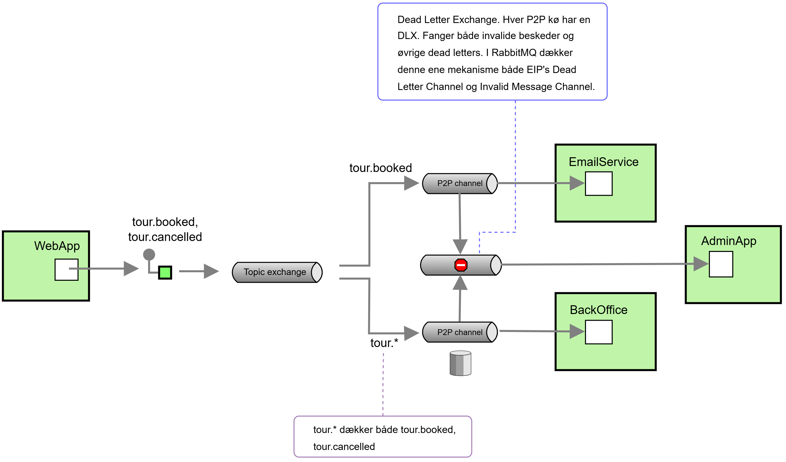

# TourBooking — RabbitMQ Messaging (System Integration, Aflevering 2)

Et tour-booking-system bygget på RabbitMQ, der demonstrerer message routing med en **Topic Exchange** og pålidelig fejlhåndtering med **Dead Letter Exchange**, **Guaranteed Delivery** og en **AdminApp** der logger døde/invalide beskeder.

Aflevering 2 udvider Aflevering 1 (topic routing) med tre ting: ingen tabte beskeder til Back-Office, opsamling af undeliverable/invalide beskeder, og en AdminApp der viser en log over dem.

## Arkitektur

Diagrammet er tegnet i EIP-notation (Enterprise Integration Patterns).



Flowet, kort:

- **WebApp** (producer) sender én besked med en routing key — `tour.booked` ved en booking, `tour.cancelled` ved en cancellation.
- **Topic Exchange** (`tours_topic`) router ud fra routing key til de to køer (pub/sub med filtrering via binding keys).
- **Email Service** binder med det eksakte `tour.booked` -> kun bookings.
- **Back-Office** binder med wildcardet `tour.*` -> både bookings og cancellations.
- **Dead Letter Exchange** (`tours_dlx`, fanout): når en besked afvises eller dør i en kø, sendes den hertil og videre til dead-letter-køen.
- **AdminApp** læser dead-letter-køen og logger de døde/invalide beskeder.

## Komponenter

| Projekt | Rolle | Detaljer |
|---|---|---|
| `TourBooking.WebApp` | Producer | Blazor Server-form; publisher `tour.booked` / `tour.cancelled` |
| `TourBooking.EmailService` | Consumer | Binding key `tour.booked`; classic queue + DLX |
| `TourBooking.BackOffice` | Consumer | Binding key `tour.*`; **quorum/durable** queue (Guaranteed Delivery) + DLX |
| `TourBooking.AdminApp` | Consumer | Læser `tours_dead_letter` og logger døde beskeder |

RabbitMQ-topologi der oprettes af koden:

- Exchanges: `tours_topic` (topic), `tours_dlx` (fanout)
- Queues: `emailservice_queue` (classic), `backoffice_queue` (quorum/durable), `tours_dead_letter` (classic)

## Forudsætninger

- [.NET SDK](https://dotnet.microsoft.com/download) (bygget på .NET 10)
- [Docker](https://www.docker.com/) til RabbitMQ

## Kør systemet

### 1. Start RabbitMQ

```bash
docker run -d --name rabbitmq -p 5672:5672 -p 15672:15672 rabbitmq:4-management
```

- `5672` = AMQP-porten (apps forbinder her)
- `15672` = Management-UI: <http://localhost:15672> (login: `guest` / `guest`)

### 2. Start de tre consumers FØRST, derefter WebApp

Rækkefølgen betyder noget: en kø findes først når dens consumer har kørt og bundet den. Start consumers før WebApp.

I hver sin terminal:

```bash
cd TourBooking.EmailService && dotnet run
cd TourBooking.BackOffice   && dotnet run
cd TourBooking.AdminApp     && dotnet run
cd TourBooking.WebApp       && dotnet run
```

### Genvej (Windows / PowerShell)

Fra roden — starter de tre consumers først, WebApp sidst:

```powershell
Set-ExecutionPolicy -Scope Process Bypass
.\run-all.ps1
```

Åbn derefter WebApp'en på den URL konsollen printer (typisk <http://localhost:5037>).

## Test (punkt 4 — via Management-UI)

### Happy path

Book eller cancel en tour i WebApp'en:

- **Book** -> `tour.booked` -> *begge* consumers logger `Received`.
- **Cancel** -> `tour.cancelled` -> *kun* Back-Office logger.

### Invalid / dead letter

Fremprovokér en dead letter direkte fra Management-UI'et:

1. **Exchanges** -> `tours_topic` -> **Publish message**.
2. Routing key: `tour.booked` — Payload: `vrøvl` (starter ikke med `BOOK:`/`CANCEL:`).
3. Publish.

Forventet: begge consumers logger `INVALID ... -> discard` (kalder `ctx.Discard()`), beskeden dead-letter'es via `tours_dlx` til `tours_dead_letter`, og **AdminApp logger den to gange** — én pr. kø der dead-letter'ede sin kopi.

### Guaranteed Delivery

1. Stop Back-Office-consumeren (Ctrl+C).
2. Book en tour i WebApp'en.
3. Management-UI -> **Queues** -> `backoffice_queue`: beskeden står som **Ready: 1** — den venter i den durable kø selvom consumeren er væk.
4. Start Back-Office igen -> den henter den ventende besked og logger den. Ingen beskeder tabt.

## Hvordan det virker (koncepter)

**Routing key vs. binding key.** Routing key sættes på *beskeden* af produceren. Binding key sættes på *bindingen* af consumeren. Brokeren matcher routing key mod binding keys. De to consumers er decoupled og uafhængige — det er alene binding key-mønsteret der styrer hvem der får hvad.

**Topic wildcards.** `*` matcher præcis ét ord; `#` matcher nul eller flere. `tour.*` matcher `tour.booked` og `tour.cancelled`, men ikke `tour.booked.vip`. Wildcards virker kun fordi exchange-typen er `topic`.

**Dead Letter Exchange (invalid + undeliverable).** En besked bliver dead når en consumer afviser den uden requeue (`ctx.Discard()` i AMQP 1.0), når TTL udløber, eller når køen er fuld. Hver consumer-kø har `tours_dlx` som sin dead-letter-exchange. I RabbitMQ dækker denne ene mekanisme både EIP's **Dead Letter Channel** og **Invalid Message Channel** — der findes ikke en separat "Invalid Message Channel"-feature; skellet er rent konceptuelt (EIP), ikke teknisk (RabbitMQ).

**AMQP 1.0 outcomes.** Consumeren svarer broker med ét af tre: `Accept()` (behandlet, slet), `Discard()` (afvist -> dead-letter hvis DLX er sat), `Requeue()` (læg tilbage og prøv igen). Bruges `Requeue()` på en permanent dårlig besked, opstår en uendelig løkke — derfor `Discard()` til dead-lettering.

**Guaranteed Delivery.** Back-Office-køen er en durable/quorum-kø: dens definition og beskeder persisteres til disk, så beskeder overlever at en consumer er nede eller at brokeren genstarter. Email Service er bevidst en almindelig (ikke-durable) kø — en tabt booking-bekræftelse er acceptabel, mens en tabt besked til Back-Office ikke er; persistering koster performance, så den bruges kun hvor det betyder noget.

## Projektstruktur

```
System Integration Afleveringer/
├─ TourBooking.WebApp/          # Producer (Blazor Server-form)
├─ TourBooking.EmailService/    # Consumer — tour.booked
├─ TourBooking.BackOffice/      # Consumer — tour.* + Guaranteed Delivery
├─ TourBooking.AdminApp/        # Consumer — dead-letter-log
├─ docs/aflevering-2-diagram.png
├─ run-all.ps1
└─ System Integration Afleveringer.slnx
```
